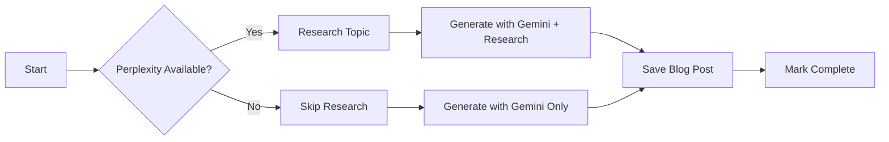

# Hybrid Blog Post Generator Setup Guide

## 🚀 Overview

The blog post generator now uses a **hybrid approach** for maximum quality and cost-effectiveness:

- **Primary Mode**: Perplexity (research) + Gemini (content generation)
- **Fallback Mode**: Gemini only (if Perplexity unavailable)

### Why This Approach?

1. **Perplexity** provides real-time web research with citations
2. **Gemini** offers free, high-quality content generation (250 requests/day free tier)
3. **Fallback** ensures blog posts always generate, even if Perplexity is down

---

## 📋 Prerequisites

You need API keys for:

1. ✅ **Google Gemini API** (Required, FREE)
2. ⚠️ **Perplexity API** (Optional, ~$20/month)

---

## 🔑 Step 1: Get Google Gemini API Key (FREE)

### Option A: Google AI Studio (Recommended)

1. Go to [Google AI Studio](https://aistudio.google.com/app/apikey)
2. Click **"Get API Key"**
3. Select or create a Google Cloud project
4. Click **"Create API Key"**
5. Copy your API key

**Cost**: FREE
- 250 requests/day (Gemini 2.5 Flash)
- More than enough for 2 blog posts/week

### Option B: Google Cloud Console

1. Go to [Google Cloud Console](https://console.cloud.google.com/)
2. Enable the **Generative Language API**
3. Create credentials → API Key
4. Copy your API key

---

## 🔑 Step 2: Get Perplexity API Key (Optional)

1. Go to [Perplexity API](https://www.perplexity.ai/settings/api)
2. Sign in or create an account
3. Click **"Generate API Key"**
4. Copy your API key

**Cost**: ~$20/month for 5,000 requests
- You'll use ~8 requests/month (2 posts/week)
- Very cost-effective

**Note**: If you skip this step, the generator will use **Gemini-only mode** (still works great!)

---

## ⚙️ Step 3: Configure GitHub Secrets

Add the API keys to your GitHub repository secrets:

1. Go to your GitHub repo: `https://github.com/Theprofitplatform/tpp`
2. Click **Settings** → **Secrets and variables** → **Actions**
3. Click **"New repository secret"**

### Required Secret:

| Secret Name | Value | Description |
|-------------|-------|-------------|
| `GEMINI_API_KEY` | Your Gemini API key | Required for content generation |

### Optional Secret:

| Secret Name | Value | Description |
|-------------|-------|-------------|
| `PERPLEXITY_API_KEY` | Your Perplexity API key | Optional for enhanced research |

### Using GitHub CLI:

```bash
# Required (FREE)
gh secret set GEMINI_API_KEY

# Optional ($20/month)
gh secret set PERPLEXITY_API_KEY
```

---

## 🧪 Step 4: Test Locally (Optional)

### Setup Local Environment

1. Create `.env.local` file in project root:

```bash
# Required
GEMINI_API_KEY=your_gemini_api_key_here

# Optional (for research mode)
PERPLEXITY_API_KEY=your_perplexity_api_key_here

# Optional (for hero images)
UNSPLASH_ACCESS_KEY=your_unsplash_key
PEXELS_API_KEY=your_pexels_key
```

2. Install dependencies (if not already done):

```bash
npm install
```

3. Test generation:

```bash
# Generate next pending topic
node automation/scripts/generate-blog-post.js

# Generate specific topic by ID
node automation/scripts/generate-blog-post.js 42
```

### Expected Output

**With Perplexity (Full Mode):**
```
🚀 Hybrid Blog Post Generator Starting...
   Mode: Perplexity Research → Gemini Generation

📝 Selected Topic:
   ID: 42
   Title: SEO for Dentists Sydney...

🔍 Researching with Perplexity AI...
✅ Research completed successfully
   Gathered 1847 characters of research
   Related questions: 5

🤖 Generating blog post with Google Gemini...

✅ Blog post generated successfully!
   Words: 3247
   Research: ✅ Enhanced with Perplexity insights
```

**Without Perplexity (Fallback Mode):**
```
🚀 Hybrid Blog Post Generator Starting...
   Mode: Perplexity Research → Gemini Generation
   Fallback: Gemini Only

⚠️  PERPLEXITY_API_KEY not found (optional, will use Gemini-only mode)

📝 Selected Topic:
   ID: 42
   Title: SEO for Dentists Sydney...

⚠️  Perplexity API key not found, skipping research phase

🤖 Generating blog post with Google Gemini...

✅ Blog post generated successfully!
   Words: 3104
   Research: ⚠️  Gemini-only mode
```

---

## 🤖 How It Works

### Workflow Overview



### Research Phase (Perplexity)

1. **Query Construction**: Creates research query for Sydney businesses
2. **Web Search**: Perplexity searches real-time web data
3. **Extract Insights**: Gathers trends, statistics, examples
4. **Related Questions**: Gets FAQ-worthy questions

### Generation Phase (Gemini)

1. **Prompt Building**: Combines topic + research insights
2. **Content Generation**: Gemini writes 2,500-3,500 word article
3. **SEO Optimization**: Meta tags, keywords, headings
4. **Sydney Context**: Local examples and references

### Fallback Logic

- If Perplexity fails → Continues with Gemini only
- No blog post generation is blocked
- Workflow always succeeds (as long as Gemini works)

---

## 📅 GitHub Actions Schedule

The workflow runs automatically:

- **Monday** at 9:00 AM UTC (8:00 PM Sydney time)
- **Thursday** at 9:00 AM UTC (8:00 PM Sydney time)

### Manual Trigger

You can also trigger manually:

1. Go to **Actions** tab
2. Select **"Daily Blog Post Generator"**
3. Click **"Run workflow"**
4. Optionally specify a topic ID

---

## 💰 Cost Analysis

### Current Setup (2 posts/week = 8/month)

| Service | Monthly Cost | Free Tier | Notes |
|---------|--------------|-----------|-------|
| **Gemini** | **$0** | 250 requests/day | Always free at your volume |
| **Perplexity** | **$20** (optional) | None | ~8 requests = minimal usage |
| **Unsplash** | **$0** | 50 requests/hour | Free for hero images |
| **Total** | **$0-20/month** | - | $0 if Gemini-only, $20 with research |

### vs. Previous Setup

| Service | Cost |
|---------|------|
| Anthropic Claude | Ran out of credits ❌ |
| **New Gemini** | **FREE** ✅ |
| **+Perplexity (optional)** | **$20/month for research** |

---

## 🔧 Troubleshooting

### Error: "GEMINI_API_KEY not found"

**Solution**: Add `GEMINI_API_KEY` to GitHub Secrets (see Step 3)

### Error: "Rate limit exceeded" (Gemini)

**Cause**: Exceeded 250 requests/day (unlikely with 2 posts/week)

**Solution**:
- Wait 24 hours for reset
- Upgrade to paid tier (still very cheap)

### Warning: "Perplexity API key not found"

**Not an error!** The system will use Gemini-only mode (still works great)

### Blog post quality seems lower without Perplexity

**Options**:
1. Add Perplexity API key for research mode
2. Adjust Gemini prompt in `generate-blog-post.js`
3. Use manual editing/refinement

---

## 📊 Monitoring

### Check Workflow Status

```bash
# View recent workflow runs
gh run list --workflow=daily-blog-post.yml --limit 5

# View specific run
gh run view <run-id>
```

### Check Blog Post Queue

```bash
# See pending topics
cat automation/topic-queue.json | jq '.queue | map(select(.status=="pending"))'

# Count pending
cat automation/topic-queue.json | jq '.queue | map(select(.status=="pending")) | length'
```

### API Usage

- **Gemini**: Check [Google AI Studio](https://aistudio.google.com/)
- **Perplexity**: Check [Perplexity Settings](https://www.perplexity.ai/settings/api)

---

## 🎯 Next Steps

1. ✅ Add `GEMINI_API_KEY` to GitHub Secrets (required)
2. ⚠️ Add `PERPLEXITY_API_KEY` to GitHub Secrets (optional, for research)
3. 🧪 Test locally with your API keys
4. 📅 Wait for next scheduled run (Monday/Thursday 9am UTC)
5. 📊 Monitor workflow runs and blog post quality

---

## 🆘 Support

### Quick Links

- [Google AI Studio](https://aistudio.google.com/)
- [Perplexity API](https://www.perplexity.ai/settings/api)
- [GitHub Actions](https://github.com/Theprofitplatform/tpp/actions)

### Common Commands

```bash
# Test blog generation locally
node automation/scripts/generate-blog-post.js

# Generate specific topic
node automation/scripts/generate-blog-post.js 42

# Check workflow runs
gh run list --workflow=daily-blog-post.yml

# Trigger manual workflow
gh workflow run daily-blog-post.yml
```

---

## 📝 Notes

- Gemini free tier is more than sufficient for your use case (2 posts/week)
- Perplexity is optional but highly recommended for better research
- Both APIs are much more reliable and cost-effective than Claude
- Fallback logic ensures blog posts always generate
